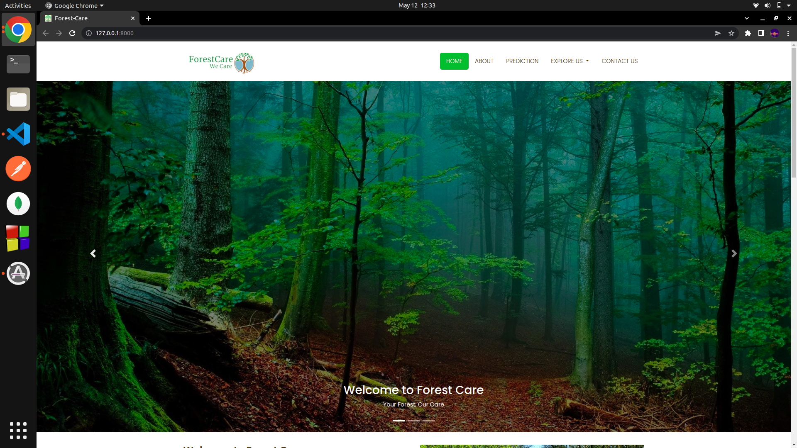
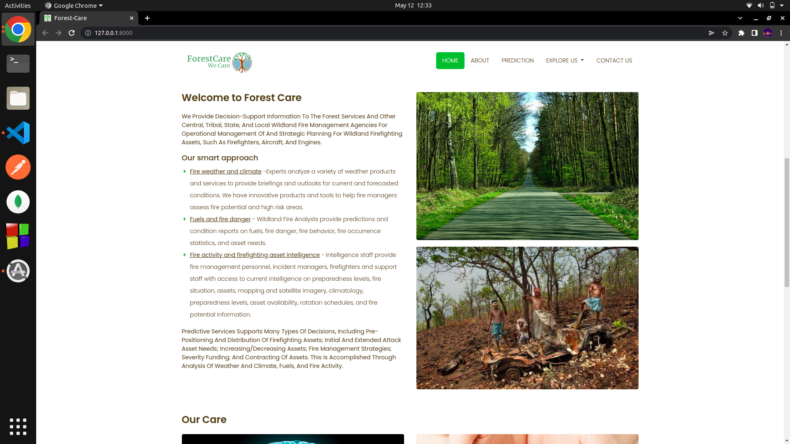
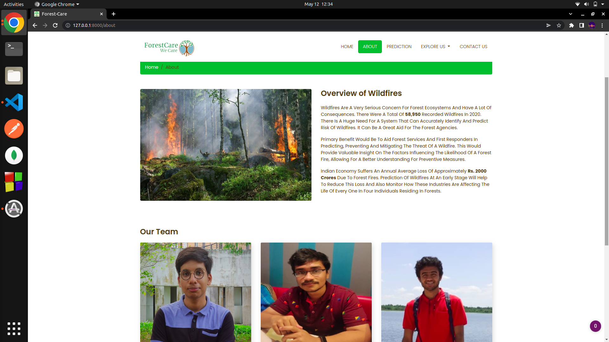
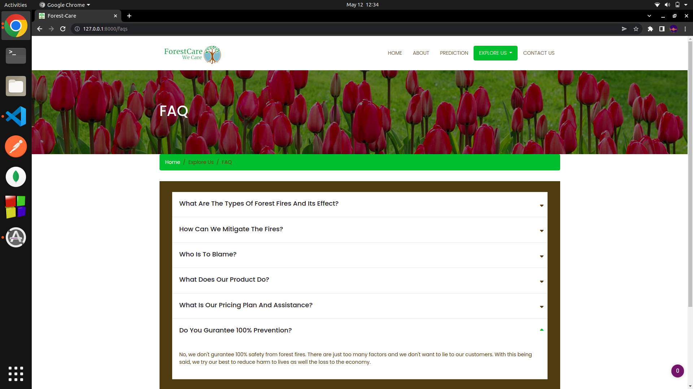
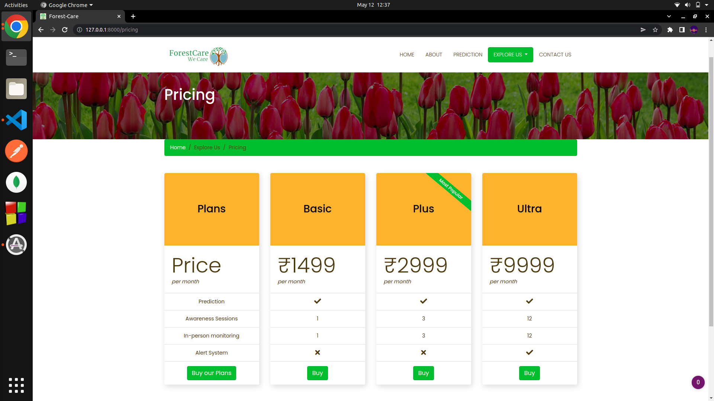
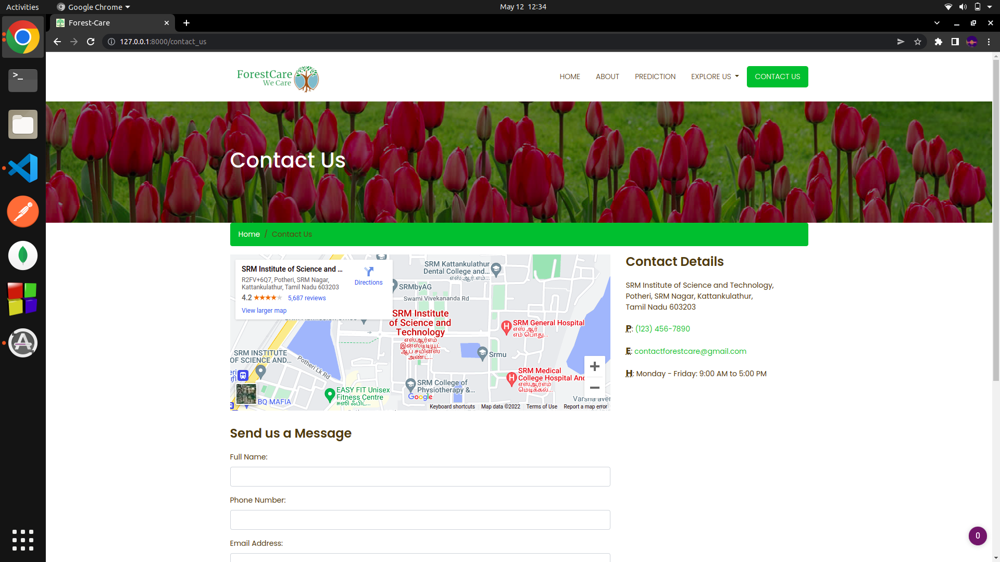
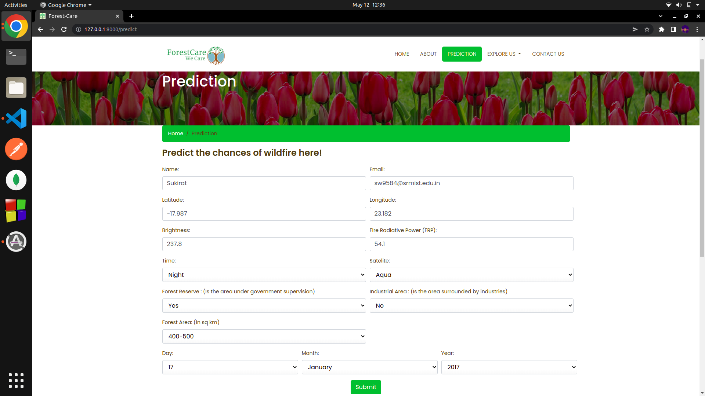
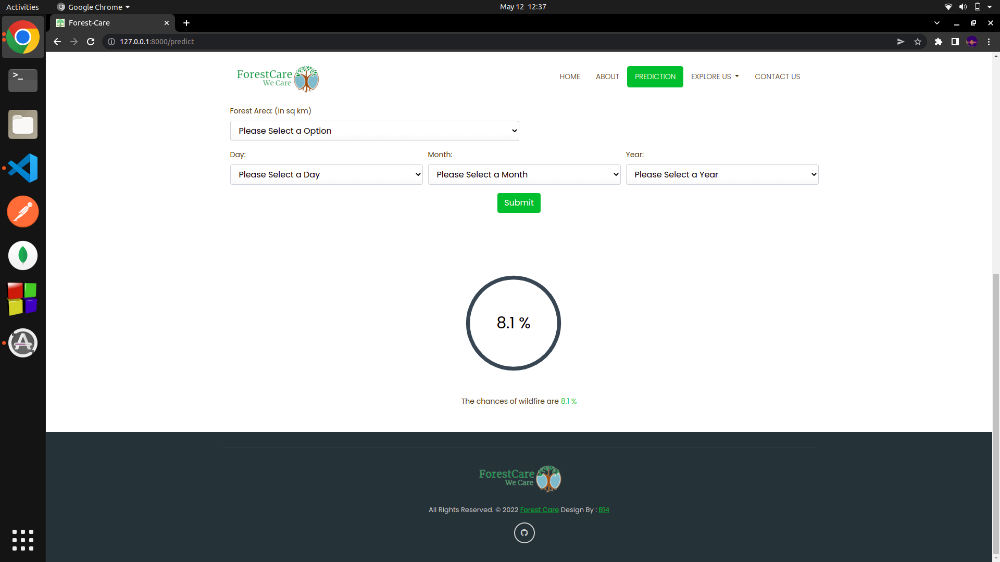

<!-- Format from Aradhya-Tripathi/fire-watch -->

<div align="center">
  
</div>

<br>
<p align="center">
<b>Forest Care is a web application that uses Machine Learning to predict the occurence & confidence of wildfires</b>
</p>

<p align="center">
  
  
  
  
  
  
</p>

## 💡 Project Description

Predict the occurence & confidence of wildfires with email notifications

## 📌 Prerequisites

### 💻 System requirement :

1. Any system with basic configuration.
2. Operating System : Any (Windows / Linux / Mac).

### 💿 Software requirement :

1. Updated browser
2. Python installed (If not download it [here](https://www.python.org/downloads/)).
3. Any text editor of your choice.

## Installation 🔧

### Clone The Repository :

```
git clone https://github.com/NVombat/Predictive-Modelling-of-Wildfires.git
cd server
```

### .env File Config :

- Setup the .env file for MongoDB, Django & Email functionality based on the .env.example file

### Server

Install python dependencies

```
$ pip install -r requirements.txt
```

### Run Server

```
$ bash run_server.sh
```

#### Application Runthrough

#### Home




#### About Us


#### FAQs


#### Pricing Plans


#### Contact Us


#### Predicting Wildfires - Data Entry


#### Predicting Wildfires - Result


## 📜 License

`ForestCare` is available under the MIT license. See the LICENSE file for more info.

## 💥 Contributors

<a href="https://github.com/Aradhya-Tripathi/fire-watch/graphs/contributors">

</a>

## 🚨 Forking this repo

Many people have contacted us asking if they can use this code for their own websites. The answer to that question is usually "yes", with attribution. There are some cases, such as using this code for a business or something that is greater than a personal project, that we may be less comfortable saying yes to. If in doubt, please don't hesitate to ask us.

We value keeping this site open source, but as you all know, _**plagiarism is bad**_. We spent a non-negligible amount of effort developing, designing, and trying to perfect this iteration of our website, and we are proud of it! All we ask is to not claim this effort as your own.

So, feel free to fork this repo. If you do, please just give proper credit!.
Refer to this handy [quora post](https://www.quora.com/Is-it-bad-to-copy-other-peoples-code) if you're not sure what to do. Thanks!
